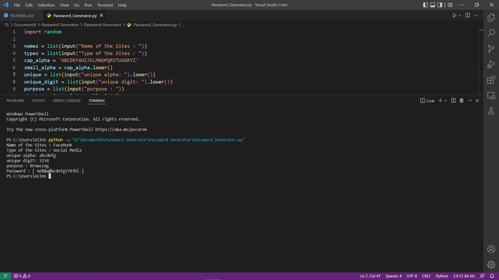

<h1 align="center">Password Generator</h1>

# In the <i>Password Generator</i> contains some features.

* You can include your websites name in your password.
* You can include your websites categories in your password.
* You can include your opening year of websites in your password.
* You can give your unique password string that also include in your password.
* You can give your unique password numbers that also include in your password.
* What purpose for you use your websites that also iclude in your password.
* Most import note, it adds custom two character starting and ending of the your output password, if don't provide any blocking layer key.  

## Transition Features:
* There are some character programatically change to other character such as `A->@`, `B->&`, `E->#`, `F->£`, `m->w` etc.

### Note 01_:
* If you want to include any character to your password must provide capital alphabet.

Example 01: Suppose you provide <b>website name</b> : `FACEbook`. then `FACE` is only added to the password.

See the attached image to clearify.  

* Unique Password and Unique Number can be provide lowercase or uppercase, all are added to the password.

### Note 02_:
You can skip any or multiple of this features [ pressing `enter` key], If you don't need to add in your password.   

## Screenshots:

## Requirements:

* Python 3 must be installed in your PC or Desktop.

## How to Run :

There are many way you can run the program. You can follow this video link to install python3 and pycharm that you need to run this code. 

<a href>https://www.youtube.com/watch?v=mO6ONGkQk9Y</a> 

Open the `Password_Generator.py` file via pycharm and run it.