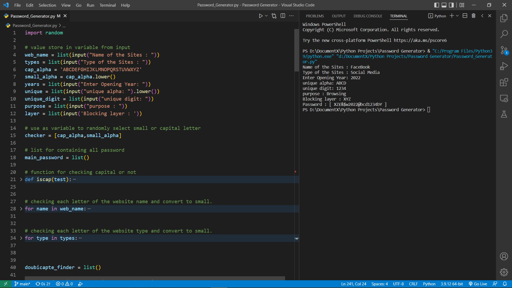

<h1 align="center">Password Generator</h1>

# In this Password Generator contains some features.

* You can include your websites name in your password.
* You can include your websites categories in your password.
* You can give your unique password string that also include in your password.
* You can give your unique password numbers that also include in your password.
* What purpose for you use your websites that also iclude in your password.
* Most Import note it add custom two character starting and ending of the your output password, if don't provide any layer key.  

### Note 01_:
If you want to include any character to your password must provide capital alphabet. See the attached image to clearify.  

### Note 02_:
You can skip any or multiple of this features, If you don't need to add in your password.   

## Screenshots:

## Requirements:

* Python 3 must be installed in your PC or Desktop.

## How to Run :

There are many way you can run the program. You can follow this video link to install python3 and pycharm that you need to run this code. 

<a href>https://www.youtube.com/watch?v=mO6ONGkQk9Y</a> 

Open the file via pycharm and run it.

